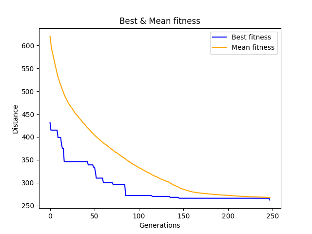
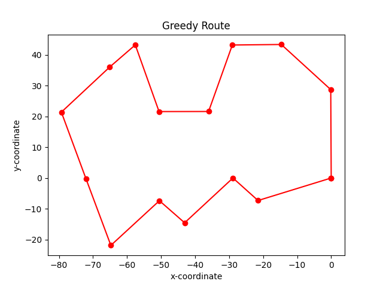

# Travelling Salesman Problem <!-- omit in toc -->

## Table of Contents <!-- omit in toc -->

- [Introduction](#introduction)
- [Algorithms](#algorithms)
- [Visualizations](#visualizations)
  - [Genetic Algorithms](#genetic-algorithms)
  - [Greedy Algorithm](#greedy-algorithm)

## Introduction

**Given a list of cities and the distances between each pair of cities, what is the shortest possible route that visits each city exactly once and returns to the origin city?** is the problem's statement and as you can see this problem is [NP-Complete](https://en.wikipedia.org/wiki/NP-completeness) which we're attempting to solve it using different types of algorithms.

## Algorithms

This repository implements effectively the follwing algorithms:

- Genetic Algorithms
- Greedy Algorithm

## Visualizations

Here you can find some visualizations that help demonstrate different **aspects** and **outcomes** of the implemented algorithms.

### Genetic Algorithms

### Greedy Algorithm

